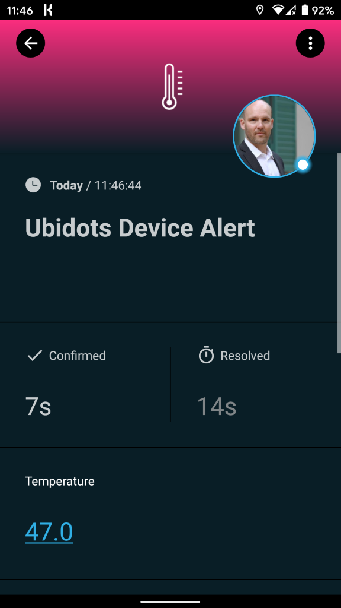
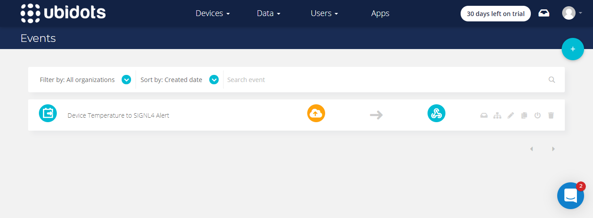
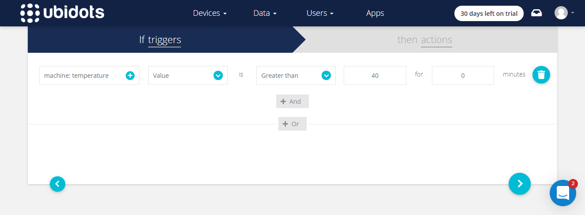
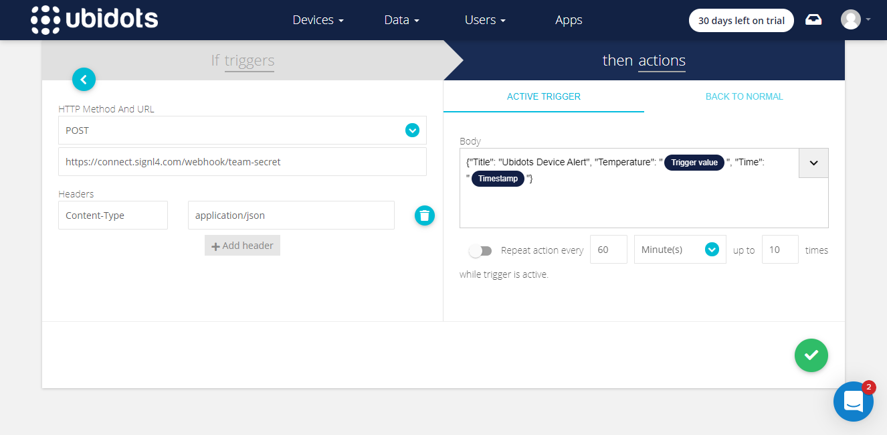
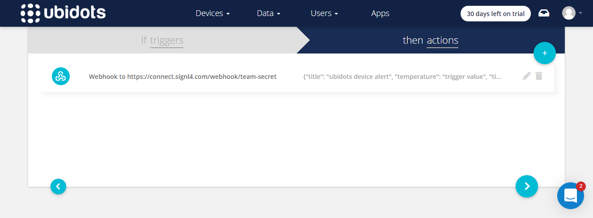
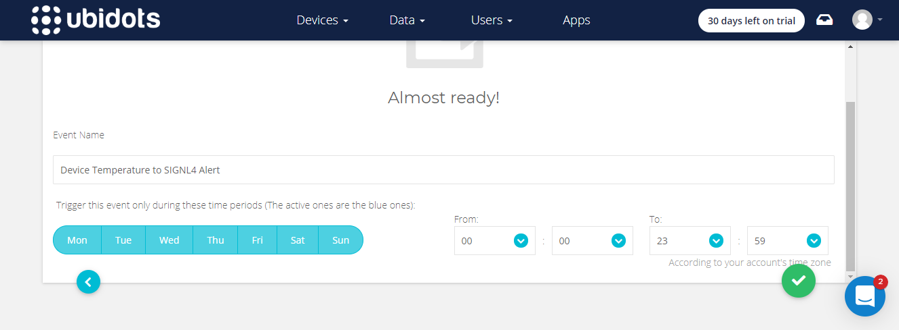

# Mobile Alarmierung per App, SMS und Anruf für Ubidots

Mobile Alarmierung mit Tracking, Bereitschafts-Planung und Eskalation für Ubidots.

## Warum SIGNL4

Ubidots bietet eine IoT-Plattform für Daten-Konnektivität, -Analyse, -Verarbeitung und -Visualisierung. Sie können Sensor-Daten in Informationen verwandeln, die für Geschäftsentscheidungen, Maschine-to-Maschine-Interaktionen oder Bildung von Nutzen sind. Die Anbindung der Geräteist per HTTP, MQTT, TCP oder UDP-Protokoll möglich. Die Integration dieser leistungsstarken IoT-Plattform mit SIGNL4 kann Ihren täglichen Betrieb durch die zuverlässige Alarmierung mobiler Teams verbessern, egal wo sich diese befinden.
 

## So funktioniert es

Alles, was für die Verknüpfung von Ubidots mit SIGNL4 nötig ist, ist ein Webhook Call, den Sie in Ihrem Ubidots-Portal als eine Event-Aktion konfigurieten können. Dies ermöglicht die Übertragung der Daten an SIGNL4 und somit die Alarmierung Ihres SIGNL4-Teams.

## Integration

- Alarmierung von Wartungsteams in SIGNL4 per mobilem Push, Text und Sprache
- Anbindung an SIGNL4 per Email (SMTP API)
- Transparente Quittierung in der mobilen App
- Eskalation von Alarmen wenn eine bestimmte Zeit verstrichen ist
- Team-Kommunikation innerhalb von Alarmen
- Nachvollziehbarkeit der Störungs-Behebung
- Integrierte Bereitschafts-Planung, um die richtigen Personen zur richtigen Zeit zu alarmieren
- Alarmierung über kritische IoT-Status
- Mögliche Zwei-Wege-Integration zur Interaktion mit Geräten

## Szenarien

- Industrielles IoT
- Industrie 4.0
- IoT Service Benachrichtigung
- IoT Geräte-Management
- Produktion, Versorgung, Öl und Gas, Landwirtschaft, etc.

## Und so funktioniert es

### Integration von SIGNL4 mit Ubidots

In unserem Beispiel verwenden wir einen Raspberry Pi als Gerät und verbinden diesen zur Ubidots-Platform, um einen Temperatur-Sensor zu simulieren. Wenn die Temperatur zu hoch ist, senden wir einen Alarm an unser SIGNL4-Team.

SIGNL4 ist eine mobile App mit der Teams schneller und effektiver auf kritische Alarme, technische Störungen und dringende Service-Aufträge reagieren können. Holen Sie sich die App unter https://www.signl4.com.

### Voraussetzungen

Ein SIGNL4-Konto (https://www.signl4.com)

Ein Ubidots-Konto (https://ubidots.com)

#### Integrations-Schritte

1. Gerät verbinden  

In unserem Fall verbinden wir eine Raspberry Pi, wie hier beschrieben: https://help.ubidots.com/en/articles/513309-connect-the-raspberry-pi-with-ubidots. Wir verwenden das im Link erwähnte Pythos-Skript, um Ereignisse zu generieren.

2. Verarbeitung der Ereignisse  

Im Ubidots-Portal können Sie unter Data -> Events einen neuen Event anlegen.

3. Trigger  

Im Trigger (Auslöser) des neuen Ereignisses können Sie Bedingungen angeben. In unserem Beispiel prüfen wir, ob die Temperatur größer als 40 Grad ist.

4. Webhook Action  

Als Action wählen Sie Webhook aus und konfigurieren die SIGNL4-Webhook-URL inklusive Ihres Team-Geheimnisses als URL. Der Body besteht aus den Daten, die Sie an SIGNL4 senden möchten im JSON-Format.

Die Action sieht nun, wie folgt aus.

5. Time Periods  

Im letzten Schritt können Sie noch die Zeiten oder Time Periods konfigurieren, zu denen der Event aktiv sein soll.

6. Testen  

Um den Aufbau zu testen, können wir ein Geräte-Ereignis simulieren. In unserem Fall tun wir das, indem wir das Python-Script auf unserem Raspberry Pi starten.`

Das ist es. Sie können nun Ihr IoT-Szenario testen, indem Sie die Temperaturänderung simulieren. Sie erhalten dann einen Alarm in Ihrer SIGNL4 App.

Ein Beispiel finden Sie auf in GitHub:
https://github.com/signl4/signl4-integration-ubidots
