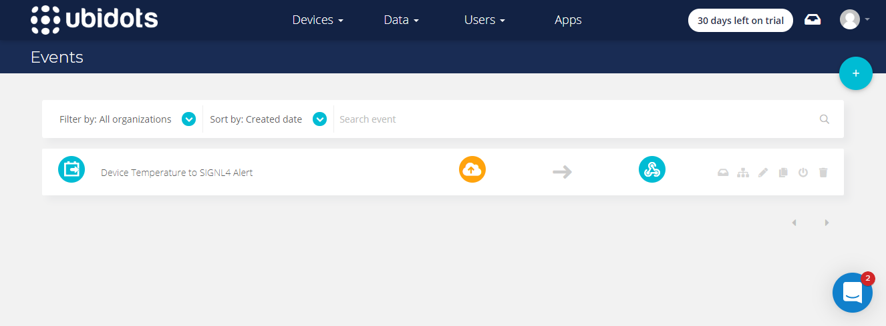

# Mobile alerting with tracking & escalation for Ubidots

Mobile alerting with tracking, duty planning and escalation for Ubidots.

## Why SIGNL4

Ubidots offers an IoT platform for data connectivity, analytics, processing and visualization. You can turn sensor data into information that matters for business-decisions, machine-to-machine interactions or educational research. Device connectivity is possible via HTTP, MQTT, TCP or UDP protocols. Pairing this powerful IoT platform with SIGNL4 can enhance your daily operations with an extension to your team on the shop floor or in the field.

## How it Works

All it takes to pair Ubidots and SIGNL4 is a webhook call you can configure in your Ubidots platform as an event action. This will send the respective data to SIGNL4 and thus to alert the responsible team.

## Integration Capabilities

- Service engineers alerted via mobile push, text and voice
- Integration with SIGNL4 via webhook or email (SMTP)
- Staff can acknowledge and take ownership for critical events that occur
- Alerts are escalated in case of no response
- Communicate within an alert to address a particular problem
- Tracking and visibility of problem solutions
- Integrated on-call duty planning
- Alert on critical IoT device states
- Two-way integration to interact or set the device state

## Scenarios

- Industrial IoT
- Industry 4.0
- IoT Service Alerting
- IoT Device Management
- IT, Manufacturing, Utility, Oil and Gas, Agriculture, etc.

## How To Integrate

### Integrating SIGNL4 with Ubidots

In our example we use a Raspberry Pi as a device and connect it to the Ubidots platform to simulate a temperature alert. When the temperature is too high we send an alert to our SIGNL4 team.

SIGNL4 is a mobile alert notification app for powerful alerting, alert management and mobile assignment of work items. Get the app at https://www.signl4.com.

### Prerequisites

A SIGNL4 account (https://www.signl4.com)

A Ubidots account (https://ubidots.com)

#### Integration Steps

1. Connect the Device  

In our case we connect a Raspberry Pi as described here: https://help.ubidots.com/en/articles/513309-connect-the-raspberry-pi-with-ubidots. We use the Pythos script mentioned in the link to generate events.

2. Process the Events  

In the Ubidots portal under Data -> Events you can create a new event.

3. Trigger  

In the Trigger of the new event you can specify conditions. In our example we check if the temperature is greater than 40 degrees.

4. Webhook Action  

As Action select webhook and configure the SIGNL4 webhooku URL including your team secret as URL. The body consists of the data you want to send to SIGNL4 in JSON format.

The Action now looks like this.

5. Time Periods  

In the last step you can configure the time periods in which the event should be active.

6. Test It  

In order to test the setup we can simulate a device event. In our example we can just start the Python script on the Raspberry by.

This is it. You can now test your IoT scenario by simulating the temperature change. You will then receive an alert in your SIGNL4 app.

You can find a sample in GitHub:
https://github.com/signl4/signl4-integration-ubidots
